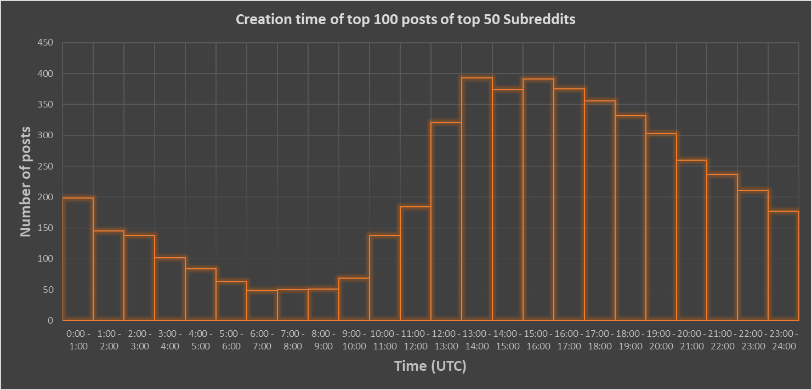

# Reddit-Statistics

Script to visualise the relation between the creation time and the total number of posts that made it to the top 100 of 50 subreddits on Reddit.
Tools: Python and MS Excel

# How to use
You'll need 
1. developer keys from the Reddit API for Authentication
2. praw module
3. openpyxl module

Run the "Main.py".
